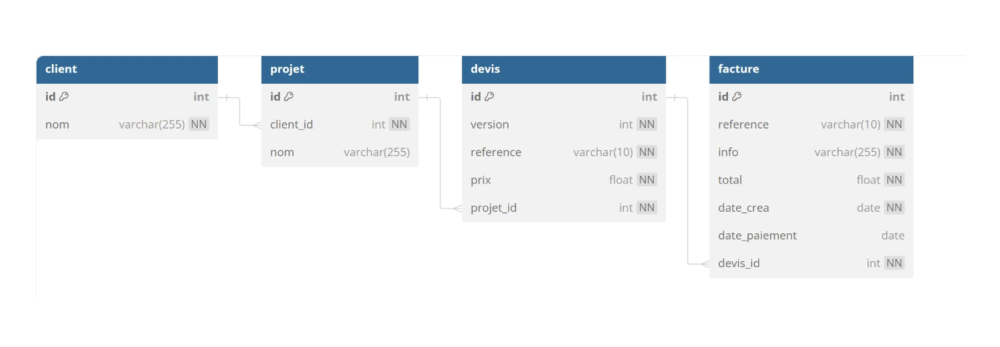
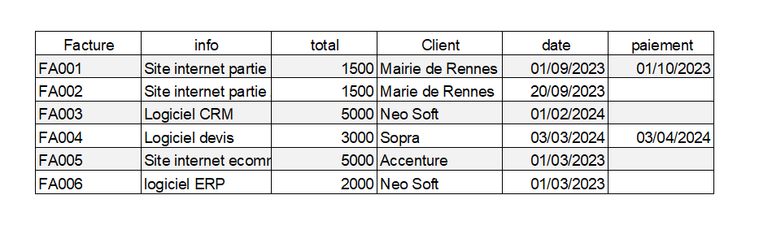

# CRM Customer  Relationship Management
Gestion des devis et factures d'une entreprise
  
Le client a un projet  
En fonction du projet , nous lui proposons plusieurs devis  
Il valide un devis  
Nous lui envoyons une facture  
  

## Modele relationnel

## Les Clients

## Les factures


## Les data
```mysql
DELETE FROM client;
DELETE FROM projet;
DELETE FROM devis;
DELETE FROM facture;

INSERT INTO client (nom) VALUES 
	('Mairie de Rennes'),
	('Neo Soft'),
	('Sopra'),
	('Accenture'),
	('Amazon');

INSERT INTO projet (nom, client_id) VALUES
	('Création de site internet', 1),
	('Creationde site internet', 1),
	('Logiciel CRM', 2),
	('Logiciel de devis', 3),
	('Site internet e-commerce', 4),
	('Logiciel ERP', 2),
	('Logicielgestion de stock',4);

    
INSERT INTO devis (version,reference, prix, projet_id) VALUES
	('1','DEV2100A', 3000, 1),
	('2','DEV2100B', 5000, 2),
	('1','DEV2100C', 5000, 3),
	('1','DEV2100D', 3000, 4),
	('1','DEV2100E', 5000, 5),
	('1','DEV2100F', 2000, 6),
	('1','DEV2100G', 1000, 7);

INSERT INTO facture (reference,info,total,devis_id,date_crea,date_paiement)	
    VALUES
	('FA001', 'site internet partie 1', 1500, 1, '2023-09-01','2023-10-01'),
	('FA002', 'site internet partie 2', 1500, 1, '2023-09-20',null),
	('FA003', 'logiciel CRM', 5000, 2, '2024-02-01',null),
	('FA004', 'logiciel devis', 3000, 3, '2024-03-03','2024-04-03'),
	('FA005', 'site ecommerce', 5000, 4, '2024-04-01',null),
	('FA006', 'logiciel ERP', 2000, 2, '2024-04-01',null);

```
# Partie 1
Créer la base de données

# Partie 2
1 - Afficher toutes les factures avec le nom des clients  
  
2 - Afficher le nombre de factures par client
afficher 0 factures si il n'y a pas de factures

3 - afficher le chiffre d'affaire par client 

4 - afficher le CA total

5 - afficher  la somme des factures en attente de paiement

6 - afficher les factures en retard de paiment 30 jours max
avec le nombre de jours de retard


# Partie 3 réaliser un modèle relationnel
  
Réaliser le modèle relationnel sur db diagram  
  
https://dbdiagram.io/
