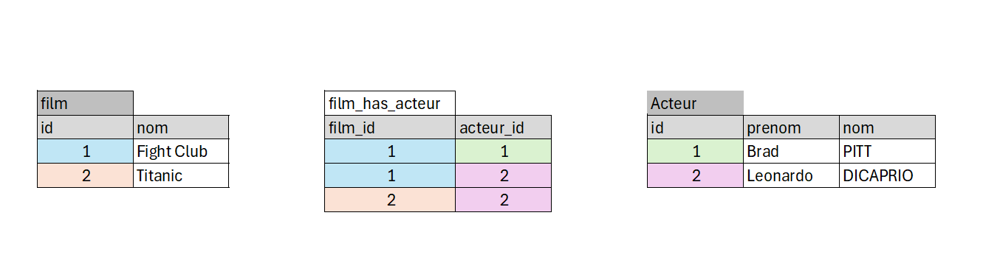

# La Table de Jointure

## modèle relationnel


### La structure des tables :
```mysql
CREATE TABLE film(
    id INT NOT NULL AUTO_INCREMENT PRIMARY KEY,
    nom VARCHAR(100) NOT NULL
)ENGINE=InnoDB;

CREATE TABLE acteur(
    id INT NOT NULL AUTO_INCREMENT PRIMARY KEY,
    prennom VARCHAR(100) NOT NULL,
    nom VARCHAR(100) NOT NULL
)ENGINE=InnoDB;

CREATE TABLE film_has_acteur(
    film_id INT NOT NULL  ,
    acteur_id INT NOT NULL,
    PRIMARY KEY(film_id,acteur_id),
    CONSTRAINT fk_acteur FOREIGN KEY (acteur_id) REFERENCES acteur(id),
       CONSTRAINT fk_film FOREIGN KEY (film_id) REFERENCES film(id)
)ENGINE=InnoDB;
```

### Les données :
```mysql
INSERT INTO film(nom) VALUES 
('Fight Club'),
('TITANIC');

INSERT INTO acteur(prenom,nom) VALUES ('Brad','PITT');
INSERT INTO acteur(prenom,nom) VALUES ('Leonardo','DICAPRIO');

INSERT INTO film_has_acteur(film_id,acteur_id) VALUES (1,1);
INSERT INTO film_has_acteur(film_id,acteur_id) VALUES (1,2);
INSERT INTO film_has_acteur(film_id,acteur_id) VALUES (2,2);
```

### Afficher Les données :
```mysql
-- afficher Fight Club
SELECT film.nom,acteur.prenom,acteur.nom 
FROM film
INNER JOIN film_has_acteur  ON film.id = film_has_acteur.film_id
INNER JOIN acteur  ON acteur.id = film_has_acteur.acteur_id
WHERE film_id=1;

-- afficher TITANIC
SELECT film.nom,acteur.prenom,acteur.nom 
FROM film
INNER JOIN film_has_acteur  ON film.id = film_has_acteur.film_id
INNER JOIN acteur  ON acteur.id = film_has_acteur.acteur_id
WHERE film_id=2;
```