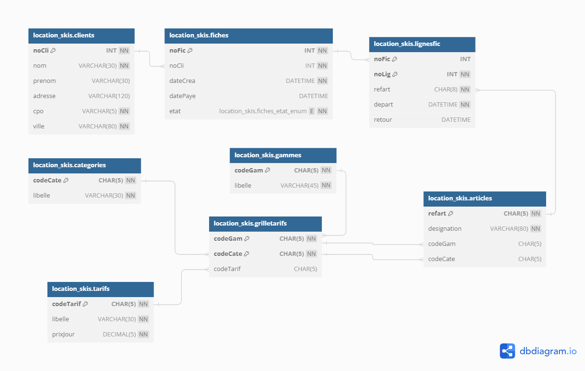

# TP 99 Location Ski




# les data
```mysql

-- -----------------------------------------------------
-- Data for table `location_skis`.`clients`
-- -----------------------------------------------------
START TRANSACTION;
USE `location_skis`;
INSERT INTO `location_skis`.`clients` (`noCli`, `nom`, `prenom`, `adresse`, `cpo`, `ville`) VALUES (1, 'Albert', 'Anatole', 'Rue des accacias', '61000', 'Amiens');
INSERT INTO `location_skis`.`clients` (`noCli`, `nom`, `prenom`, `adresse`, `cpo`, `ville`) VALUES (2, 'Bernard', 'Barnabé', 'Rue du bar', '1000', 'Bourg en Bresse');
INSERT INTO `location_skis`.`clients` (`noCli`, `nom`, `prenom`, `adresse`, `cpo`, `ville`) VALUES (3, 'Dupond', 'Camille', 'Rue Crébillon', '44000', 'Nantes');
INSERT INTO `location_skis`.`clients` (`noCli`, `nom`, `prenom`, `adresse`, `cpo`, `ville`) VALUES (4, 'Desmoulin', 'Daniel', 'Rue descendante', '21000', 'Dijon');
INSERT INTO `location_skis`.`clients` (`noCli`, `nom`, `prenom`, `adresse`, `cpo`, `ville`) VALUES (5, 'Ernest', 'Etienne', 'Rue de l’échaffaud', '42000', 'Saint Étienne');
INSERT INTO `location_skis`.`clients` (`noCli`, `nom`, `prenom`, `adresse`, `cpo`, `ville`) VALUES (6, 'Ferdinand', 'François', 'Rue de la convention', '44100', 'Nantes');
INSERT INTO `location_skis`.`clients` (`noCli`, `nom`, `prenom`, `adresse`, `cpo`, `ville`) VALUES (9, 'Dupond', 'Jean', 'Rue des mimosas', '75018', 'Paris');
INSERT INTO `location_skis`.`clients` (`noCli`, `nom`, `prenom`, `adresse`, `cpo`, `ville`) VALUES (14, 'Boutaud', 'Sabine', 'Rue des platanes', '75002', 'Paris');

COMMIT;


-- -----------------------------------------------------
-- Data for table `location_skis`.`fiches`
-- -----------------------------------------------------
START TRANSACTION;
USE `location_skis`;
INSERT INTO `location_skis`.`fiches` (`noFic`, `noCli`, `dateCrea`, `datePaye`, `etat`) VALUES (1001, 14,  DATE_SUB(NOW(),INTERVAL  15 DAY), DATE_SUB(NOW(),INTERVAL  13 DAY),'SO');
INSERT INTO `location_skis`.`fiches` (`noFic`, `noCli`, `dateCrea`, `datePaye`, `etat`) VALUES (1002, 4,  DATE_SUB(NOW(),INTERVAL  13 DAY), NULL, 'EC');
INSERT INTO `location_skis`.`fiches` (`noFic`, `noCli`, `dateCrea`, `datePaye`, `etat`) VALUES (1003, 1,  DATE_SUB(NOW(),INTERVAL  12 DAY), DATE_SUB(NOW(),INTERVAL  10 DAY),'SO');
INSERT INTO `location_skis`.`fiches` (`noFic`, `noCli`, `dateCrea`, `datePaye`, `etat`) VALUES (1004, 6,  DATE_SUB(NOW(),INTERVAL  11 DAY), NULL, 'EC');
INSERT INTO `location_skis`.`fiches` (`noFic`, `noCli`, `dateCrea`, `datePaye`, `etat`) VALUES (1005, 3,  DATE_SUB(NOW(),INTERVAL  10 DAY), NULL, 'EC');
INSERT INTO `location_skis`.`fiches` (`noFic`, `noCli`, `dateCrea`, `datePaye`, `etat`) VALUES (1006, 9,  DATE_SUB(NOW(),INTERVAL  10 DAY),NULL ,'RE');
INSERT INTO `location_skis`.`fiches` (`noFic`, `noCli`,  `dateCrea`,`datePaye`, `etat`) VALUES (1007, 1,  DATE_SUB(NOW(),INTERVAL  3 DAY), NULL, 'EC');
INSERT INTO `location_skis`.`fiches` (`noFic`, `noCli`,  `dateCrea`,`datePaye`, `etat`) VALUES (1008, 2,  DATE_SUB(NOW(),INTERVAL  0 DAY), NULL, 'EC');

COMMIT;


-- -----------------------------------------------------
-- Data for table `location_skis`.`tarifs`
-- -----------------------------------------------------
START TRANSACTION;
USE `location_skis`;
INSERT INTO `location_skis`.`tarifs` (`codeTarif`, `libelle`, `prixJour`) VALUES ('T1', 'Base', 10);
INSERT INTO `location_skis`.`tarifs` (`codeTarif`, `libelle`, `prixJour`) VALUES ('T2', 'Chocolat', 15);
INSERT INTO `location_skis`.`tarifs` (`codeTarif`, `libelle`, `prixJour`) VALUES ('T3', 'Bronze', 20);
INSERT INTO `location_skis`.`tarifs` (`codeTarif`, `libelle`, `prixJour`) VALUES ('T4', 'Argent', 30);
INSERT INTO `location_skis`.`tarifs` (`codeTarif`, `libelle`, `prixJour`) VALUES ('T5', 'Or', 50);
INSERT INTO `location_skis`.`tarifs` (`codeTarif`, `libelle`, `prixJour`) VALUES ('T6', 'Platine', 90);

COMMIT;


-- -----------------------------------------------------
-- Data for table `location_skis`.`gammes`
-- -----------------------------------------------------
START TRANSACTION;
USE `location_skis`;
INSERT INTO `location_skis`.`gammes` (`codeGam`, `libelle`) VALUES ('PR', 'Matériel Professionnel');
INSERT INTO `location_skis`.`gammes` (`codeGam`, `libelle`) VALUES ('HG', 'Haut de gamme');
INSERT INTO `location_skis`.`gammes` (`codeGam`, `libelle`) VALUES ('MG', 'Moyenne gamme');
INSERT INTO `location_skis`.`gammes` (`codeGam`, `libelle`) VALUES ('EG', 'Entrée de gamme');

COMMIT;


-- -----------------------------------------------------
-- Data for table `location_skis`.`categories`
-- -----------------------------------------------------
START TRANSACTION;
USE `location_skis`;
INSERT INTO `location_skis`.`categories` (`codeCate`, `libelle`) VALUES ('MONO', 'Monoski');
INSERT INTO `location_skis`.`categories` (`codeCate`, `libelle`) VALUES ('SURF', 'Surf');
INSERT INTO `location_skis`.`categories` (`codeCate`, `libelle`) VALUES ('PA', 'Patinette');
INSERT INTO `location_skis`.`categories` (`codeCate`, `libelle`) VALUES ('FOA', 'Ski de fond alternatif');
INSERT INTO `location_skis`.`categories` (`codeCate`, `libelle`) VALUES ('FOP', 'Ski de fond patineur');
INSERT INTO `location_skis`.`categories` (`codeCate`, `libelle`) VALUES ('SA', 'Ski alpin');

COMMIT;


-- -----------------------------------------------------
-- Data for table `location_skis`.`grilletarifs`
-- -----------------------------------------------------
START TRANSACTION;
USE `location_skis`;
INSERT INTO `location_skis`.`grilletarifs` (`codeGam`, `codeCate`, `codeTarif`) VALUES ('EG', 'MONO', 'T1');
INSERT INTO `location_skis`.`grilletarifs` (`codeGam`, `codeCate`, `codeTarif`) VALUES ('MG', 'MONO', 'T2');
INSERT INTO `location_skis`.`grilletarifs` (`codeGam`, `codeCate`, `codeTarif`) VALUES ('EG', 'SURF', 'T1');
INSERT INTO `location_skis`.`grilletarifs` (`codeGam`, `codeCate`, `codeTarif`) VALUES ('MG', 'SURF', 'T2');
INSERT INTO `location_skis`.`grilletarifs` (`codeGam`, `codeCate`, `codeTarif`) VALUES ('HG', 'SURF', 'T3');
INSERT INTO `location_skis`.`grilletarifs` (`codeGam`, `codeCate`, `codeTarif`) VALUES ('PR', 'SURF', 'T5');
INSERT INTO `location_skis`.`grilletarifs` (`codeGam`, `codeCate`, `codeTarif`) VALUES ('EG', 'PA', 'T1');
INSERT INTO `location_skis`.`grilletarifs` (`codeGam`, `codeCate`, `codeTarif`) VALUES ('MG', 'PA', 'T2');
INSERT INTO `location_skis`.`grilletarifs` (`codeGam`, `codeCate`, `codeTarif`) VALUES ('EG', 'FOA', 'T1');
INSERT INTO `location_skis`.`grilletarifs` (`codeGam`, `codeCate`, `codeTarif`) VALUES ('MG', 'FOA', 'T2');
INSERT INTO `location_skis`.`grilletarifs` (`codeGam`, `codeCate`, `codeTarif`) VALUES ('HG', 'FOA', 'T4');
INSERT INTO `location_skis`.`grilletarifs` (`codeGam`, `codeCate`, `codeTarif`) VALUES ('PR', 'FOA', 'T6');
INSERT INTO `location_skis`.`grilletarifs` (`codeGam`, `codeCate`, `codeTarif`) VALUES ('EG', 'FOP', 'T2');
INSERT INTO `location_skis`.`grilletarifs` (`codeGam`, `codeCate`, `codeTarif`) VALUES ('MG', 'FOP', 'T3');
INSERT INTO `location_skis`.`grilletarifs` (`codeGam`, `codeCate`, `codeTarif`) VALUES ('HG', 'FOP', 'T4');
INSERT INTO `location_skis`.`grilletarifs` (`codeGam`, `codeCate`, `codeTarif`) VALUES ('PR', 'FOP', 'T6');
INSERT INTO `location_skis`.`grilletarifs` (`codeGam`, `codeCate`, `codeTarif`) VALUES ('EG', 'SA', 'T1');
INSERT INTO `location_skis`.`grilletarifs` (`codeGam`, `codeCate`, `codeTarif`) VALUES ('MG', 'SA', 'T2');
INSERT INTO `location_skis`.`grilletarifs` (`codeGam`, `codeCate`, `codeTarif`) VALUES ('HG', 'SA', 'T4');
INSERT INTO `location_skis`.`grilletarifs` (`codeGam`, `codeCate`, `codeTarif`) VALUES ('PR', 'SA', 'T6');

COMMIT;


-- -----------------------------------------------------
-- Data for table `location_skis`.`articles`
-- -----------------------------------------------------
START TRANSACTION;
USE `location_skis`;
INSERT INTO `location_skis`.`articles` (`refart`, `designation`, `codeGam`, `codeCate`) VALUES ('F01', 'Fischer Cruiser', 'EG', 'FOA');
INSERT INTO `location_skis`.`articles` (`refart`, `designation`, `codeGam`, `codeCate`) VALUES ('F02', 'Fischer Cruiser', 'EG', 'FOA');
INSERT INTO `location_skis`.`articles` (`refart`, `designation`, `codeGam`, `codeCate`) VALUES ('F03', 'Fischer Cruiser', 'EG', 'FOA');
INSERT INTO `location_skis`.`articles` (`refart`, `designation`, `codeGam`, `codeCate`) VALUES ('F04', 'Fischer Cruiser', 'EG', 'FOA');
INSERT INTO `location_skis`.`articles` (`refart`, `designation`, `codeGam`, `codeCate`) VALUES ('F05', 'Fischer Cruiser', 'EG', 'FOA');
INSERT INTO `location_skis`.`articles` (`refart`, `designation`, `codeGam`, `codeCate`) VALUES ('F10', 'Fischer Sporty Crown', 'MG', 'FOA');
INSERT INTO `location_skis`.`articles` (`refart`, `designation`, `codeGam`, `codeCate`) VALUES ('F20', 'Fischer RCS Classic GOLD', 'PR', 'FOA');
INSERT INTO `location_skis`.`articles` (`refart`, `designation`, `codeGam`, `codeCate`) VALUES ('F21', 'Fischer RCS Classic GOLD', 'PR', 'FOA');
INSERT INTO `location_skis`.`articles` (`refart`, `designation`, `codeGam`, `codeCate`) VALUES ('F22', 'Fischer RCS Classic GOLD', 'PR', 'FOA');
INSERT INTO `location_skis`.`articles` (`refart`, `designation`, `codeGam`, `codeCate`) VALUES ('F23', 'Fischer RCS Classic GOLD', 'PR', 'FOA');
INSERT INTO `location_skis`.`articles` (`refart`, `designation`, `codeGam`, `codeCate`) VALUES ('F50', 'Fischer SOSSkating VASA', 'HG', 'FOP');
INSERT INTO `location_skis`.`articles` (`refart`, `designation`, `codeGam`, `codeCate`) VALUES ('F60', 'Fischer RCS CARBOLITE Skating', 'PR', 'FOP');
INSERT INTO `location_skis`.`articles` (`refart`, `designation`, `codeGam`, `codeCate`) VALUES ('F61', 'Fischer RCS CARBOLITE Skating', 'PR', 'FOP');
INSERT INTO `location_skis`.`articles` (`refart`, `designation`, `codeGam`, `codeCate`) VALUES ('F62', 'Fischer RCS CARBOLITE Skating', 'PR', 'FOP');
INSERT INTO `location_skis`.`articles` (`refart`, `designation`, `codeGam`, `codeCate`) VALUES ('F63', 'Fischer RCS CARBOLITE Skating', 'PR', 'FOP');
INSERT INTO `location_skis`.`articles` (`refart`, `designation`, `codeGam`, `codeCate`) VALUES ('F64', 'Fischer RCS CARBOLITE Skating', 'PR', 'FOP');
INSERT INTO `location_skis`.`articles` (`refart`, `designation`, `codeGam`, `codeCate`) VALUES ('P01', 'Décathlon Allegre junior 150', 'EG', 'PA');
INSERT INTO `location_skis`.`articles` (`refart`, `designation`, `codeGam`, `codeCate`) VALUES ('P10', 'Fischer mini ski patinette', 'MG', 'PA');
INSERT INTO `location_skis`.`articles` (`refart`, `designation`, `codeGam`, `codeCate`) VALUES ('P11', 'Fischer mini ski patinette', 'MG', 'PA');
INSERT INTO `location_skis`.`articles` (`refart`, `designation`, `codeGam`, `codeCate`) VALUES ('S01', 'Décathlon Apparition', 'EG', 'SURF');
INSERT INTO `location_skis`.`articles` (`refart`, `designation`, `codeGam`, `codeCate`) VALUES ('S02', 'Décathlon Apparition', 'EG', 'SURF');
INSERT INTO `location_skis`.`articles` (`refart`, `designation`, `codeGam`, `codeCate`) VALUES ('S03', 'Décathlon Apparition', 'EG', 'SURF');
INSERT INTO `location_skis`.`articles` (`refart`, `designation`, `codeGam`, `codeCate`) VALUES ('A01', 'Salomon 24X+Z12', 'EG', 'SA');
INSERT INTO `location_skis`.`articles` (`refart`, `designation`, `codeGam`, `codeCate`) VALUES ('A02', 'Salomon 24X+Z12', 'EG', 'SA');
INSERT INTO `location_skis`.`articles` (`refart`, `designation`, `codeGam`, `codeCate`) VALUES ('A03', 'Salomon 24X+Z12', 'EG', 'SA');
INSERT INTO `location_skis`.`articles` (`refart`, `designation`, `codeGam`, `codeCate`) VALUES ('A04', 'Salomon 24X+Z12', 'EG', 'SA');
INSERT INTO `location_skis`.`articles` (`refart`, `designation`, `codeGam`, `codeCate`) VALUES ('A05', 'Salomon 24X+Z12', 'EG', 'SA');
INSERT INTO `location_skis`.`articles` (`refart`, `designation`, `codeGam`, `codeCate`) VALUES ('A10', 'Salomon Pro Link Equipe 4S', 'PR', 'SA');
INSERT INTO `location_skis`.`articles` (`refart`, `designation`, `codeGam`, `codeCate`) VALUES ('A11', 'Salomon Pro Link Equipe 4S', 'PR', 'SA');
INSERT INTO `location_skis`.`articles` (`refart`, `designation`, `codeGam`, `codeCate`) VALUES ('A21', 'Salomon 3V RACE JR+L10', 'PR', 'SA');

COMMIT;


-- -----------------------------------------------------
-- Data for table `location_skis`.`lignesfic`
-- -----------------------------------------------------
START TRANSACTION;
USE `location_skis`;
INSERT INTO `location_skis`.`lignesfic` (`noFic`, `noLig`, `refart`, `depart`, `retour`) VALUES (1001, 1, 'F05', DATE_SUB(NOW(),INTERVAL  15 DAY), DATE_SUB(NOW(),INTERVAL  13 DAY));
INSERT INTO `location_skis`.`lignesfic` (`noFic`, `noLig`, `refart`, `depart`, `retour`) VALUES (1001, 2, 'F50', DATE_SUB(NOW(),INTERVAL  15 DAY), DATE_SUB(NOW(),INTERVAL  14 DAY));
INSERT INTO `location_skis`.`lignesfic` (`noFic`, `noLig`, `refart`, `depart`, `retour`) VALUES (1001, 3, 'F60', DATE_SUB(NOW(),INTERVAL  13 DAY), DATE_SUB(NOW(),INTERVAL  13 DAY));
INSERT INTO `location_skis`.`lignesfic` (`noFic`, `noLig`, `refart`, `depart`, `retour`) VALUES (1002, 1, 'A03', DATE_SUB(NOW(),INTERVAL  13 DAY), DATE_SUB(NOW(),INTERVAL  9 DAY));
INSERT INTO `location_skis`.`lignesfic` (`noFic`, `noLig`, `refart`, `depart`, `retour`) VALUES (1002, 2, 'A04', DATE_SUB(NOW(),INTERVAL  12 DAY), DATE_SUB(NOW(),INTERVAL  7 DAY));
INSERT INTO `location_skis`.`lignesfic` (`noFic`, `noLig`, `refart`, `depart`, `retour`) VALUES (1002, 3, 'S03', DATE_SUB(NOW(),INTERVAL  8 DAY), NULL);
INSERT INTO `location_skis`.`lignesfic` (`noFic`, `noLig`, `refart`, `depart`, `retour`) VALUES (1003, 1, 'F50', DATE_SUB(NOW(),INTERVAL  12 DAY), DATE_SUB(NOW(),INTERVAL  10 DAY));
INSERT INTO `location_skis`.`lignesfic` (`noFic`, `noLig`, `refart`, `depart`, `retour`) VALUES (1003, 2, 'F05', DATE_SUB(NOW(),INTERVAL  12 DAY), DATE_SUB(NOW(),INTERVAL  10 DAY));
INSERT INTO `location_skis`.`lignesfic` (`noFic`, `noLig`, `refart`, `depart`, `retour`) VALUES (1004, 1, 'P01', DATE_SUB(NOW(),INTERVAL  6 DAY), NULL);
INSERT INTO `location_skis`.`lignesfic` (`noFic`, `noLig`, `refart`, `depart`, `retour`) VALUES (1005, 1, 'F05', DATE_SUB(NOW(),INTERVAL  9 DAY), DATE_SUB(NOW(),INTERVAL  5 DAY));
INSERT INTO `location_skis`.`lignesfic` (`noFic`, `noLig`, `refart`, `depart`, `retour`) VALUES (1005, 2, 'F10', DATE_SUB(NOW(),INTERVAL  4 DAY), NULL);
INSERT INTO `location_skis`.`lignesfic` (`noFic`, `noLig`, `refart`, `depart`, `retour`) VALUES (1006, 1, 'S01', DATE_SUB(NOW(),INTERVAL  10 DAY), DATE_SUB(NOW(),INTERVAL  9 DAY));
INSERT INTO `location_skis`.`lignesfic` (`noFic`, `noLig`, `refart`, `depart`, `retour`) VALUES (1006, 2, 'S02', DATE_SUB(NOW(),INTERVAL  10 DAY), DATE_SUB(NOW(),INTERVAL  9 DAY));
INSERT INTO `location_skis`.`lignesfic` (`noFic`, `noLig`, `refart`, `depart`, `retour`) VALUES (1006, 3, 'S03', DATE_SUB(NOW(),INTERVAL  10 DAY), DATE_SUB(NOW(),INTERVAL  9 DAY));
INSERT INTO `location_skis`.`lignesfic` (`noFic`, `noLig`, `refart`, `depart`, `retour`) VALUES (1007, 1, 'F50', DATE_SUB(NOW(),INTERVAL  3 DAY), DATE_SUB(NOW(),INTERVAL  2 DAY));
INSERT INTO `location_skis`.`lignesfic` (`noFic`, `noLig`, `refart`, `depart`, `retour`) VALUES (1007, 3, 'F60', DATE_SUB(NOW(),INTERVAL  1 DAY), NULL);
INSERT INTO `location_skis`.`lignesfic` (`noFic`, `noLig`, `refart`, `depart`, `retour`) VALUES (1007, 2, 'F05', DATE_SUB(NOW(),INTERVAL  3 DAY), NULL);
INSERT INTO `location_skis`.`lignesfic` (`noFic`, `noLig`, `refart`, `depart`, `retour`) VALUES (1007, 4, 'S02', DATE_SUB(NOW(),INTERVAL  0 DAY), NULL);
INSERT INTO `location_skis`.`lignesfic` (`noFic`, `noLig`, `refart`, `depart`, `retour`) VALUES (1008, 1, 'S01', DATE_SUB(NOW(),INTERVAL  0 DAY), NULL);

COMMIT;


```

1 - Créer la table

# partie 2
1.	Liste des clients (nom, prénom, adresse, code postal, ville) ayant au moins une fiche de location en cours.  
2.	Détail de la fiche de location de M. Dupond Jean de Paris (avec la désignation des articles loués, la date de départ et de retour).  
3.	Liste de tous les articles (référence, désignation et libellé de la catégorie) dont le libellé de la catégorie contient ski.  
4.	Calcul du montant de chaque fiche soldée et du montant total des fiches.  
5.	Calcul du nombre d’articles actuellement en cours de location.  
6.	Calcul du nombre d’articles loués, par client.  
7.	Liste des clients qui ont effectué (ou sont en train d’effectuer) plus de 200€ de location.  
8.	Liste de tous les articles (loués au moins une fois) et le nombre de fois où ils ont été loués, triés du plus loué au moins loué.  
9.	Liste des fiches (n°, nom, prénom) de moins de 150€.  
10.	Calcul de la moyenne des recettes de location de surf (combien peut-on espérer gagner pour une location d'un surf ?).  
11.	Calcul de la durée moyenne d'une location d'une paire de skis (en journées entières).  

