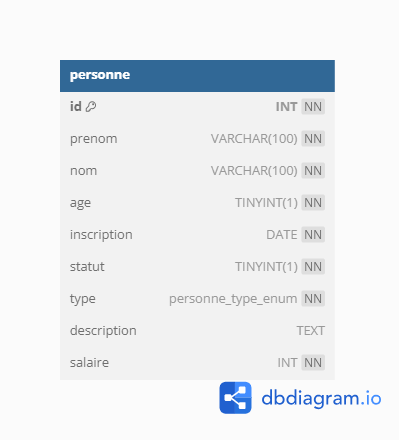
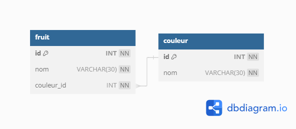

# Plan de la formation

## JOUR 1

### Creation de data base
- Créer une base de données  
- Effacer une base de données  
### Creation d'une table
- Créer une table  
- Effacer une table  
- Ajouter des champs avec un type  
- Créer une contrainte de clef primare  
- Créer une contrainte de nullité  
- Mettre des valeur par défault  

### Ajouter des données
- Ajouter des données avec ou sans clef primaire  
- Tester les valeurs par défaults  
- Tester les valeurs null  

### Lecture des données
- Prendre en main **as**
- Utiliser la condition **where**
- Filtrer avec **LIMIT**
- Classer avec **ORDER BY**

**TP invitation**
Création d'une table personne
  

  
## JOUR 2

### Révision
TP de Révision chat du JOUR 1

### la clef étrangère
- créer une clef étrangère  
- remplir une table avec un clef étrangère  
- Présentation de db diagram    

**TP chat avec jointure**
Création d'une table chat et couleur

## JOUR 3

### Les Jointures :
LEFT RIGHT ou INNER JOIN ?
Mettre en place des jointures pour extraires les données

### TP Chats
- Afficher les chat avec les couleurs des yeux 

### TP CRM 
- Extraire les données avec plusieurs jointure
- mettre en place un left join

## JOUR 4 

### les tables de jointures
Créer une table de jointure 

### TP location ski

